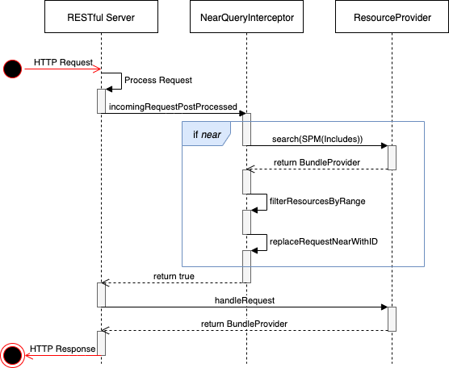

# Da Vinci PDEX Plan Network Reference Server

This project is a reference FHIR server for the [Da Vinci Payer Data exchange 
Plan Network Implementation
Guide](https://build.fhir.org/ig/HL7/davinci-pdex-plan-net/index.html). It is
based on the [HAPI FHIR JPA
Server](https://github.com/hapifhir/hapi-fhir-jpaserver-starter).

# Running Locally

The easiest way to run this server is to use docker. First, clone this
repository. Then, from the repository root run:

```
docker build -t plan-net .
```

This will build the docker image for the reference server. Once the image has
been built, the server can be run with the following command:

```
docker run -p 8080:8080 plan-net
```

The server will then be browseable at
[http://localhost:8080/](http://localhost:8080/), and the
server's FHIR endpoint will be available at
[http://localhost:8080/fhir](http://localhost:8080/fhir)

## Near Query Interceptor

While mostly based off the [HAPI FHIR JPA
Server](https://github.com/hapifhir/hapi-fhir-jpaserver-starter), this 
reference server does have some unique functionality. The HAPI FHIR base does 
not currently support searching with any [special 
parameters](https://www.hl7.org/fhir/search.html#special), which includes 
`near` searching. To work around this and mock support for `near` searching, 
we wrote `NearQueryInterceptor.java` and `Range.java`.

### How It Works

`NearQueryInterceptor.java` extends [Interceptor 
Adapter](https://hapifhir.io/apidocs-server/ca/uhn/fhir/rest/server/interceptor/InterceptorAdapter.html).
It overrides `incomingRequestPostProcessed` to screen for `near` searches. If 
it catches one, it requests all related resources from HAPI's existing search 
logic then determines which are relevant to the search in-memory. Then it 
swaps out the `near` param with an equivalent `_id` param (which is 
supported), and passes the tweaked request along for HAPI to handle. This 
sequence diagram should make things more clear:



It also overrides `outgoingResponse` to remove the tweaked request url from 
the `Bundle` and replace it with the original request url

### Valid Example Queries

```http
GET [base]/Location?near=43.878082|-103.457437

GET [base]/HealthcareService?location.near=42.505554|-71.236877||mi

GET [base]/Organization?_has:OrganizationAffiliation:participating-organization:location.near=28.367013|-81.549464|100
```

### Near Query Parameters

Below are the **required** and *optional* query parameters for `near=lat|lon|rad|unit`

* **lat**
    * **Required**
    * The latitude that marks the center of the searching range
    * Must be a number (very likely a decimal)
* **lon**
    * **Required**
    * The longitude that marks the center of the searching range
    * Must be a number (very likely a decimal)
* *rad*
    * *Optional*
    * The radius that helps define the size of the searching range
    * If defined, must be a positive number
    * Undefined defaults to 25
* *unit*
    * *Optional*
    * The units that the radius of the searching range will be interpretted as
    * Supports 4 units of distance, each with 4 valid identifiers for querying
        * KILOMETERS, which can be referred to by `unit=`
            * `km`
            * `kms`
            * `kilometer`
            * `kilometers`
        * MILES, which can be referred to by `unit=`
            * `mi`
            * `mis`
            * `mile`
            * `miles`
        * METERS, which can be referred to by `unit=`
            * `m`
            * `ms`
            * `meter`
            * `meters`
        * FEET, which can be referred to by `unit=`
            * `ft`
            * `fts`
            * `foot`
            * `feet`
    * Undefined defaults to KILOMETERS
    * Defined yet unrecognized also defaults to KILOMETERS